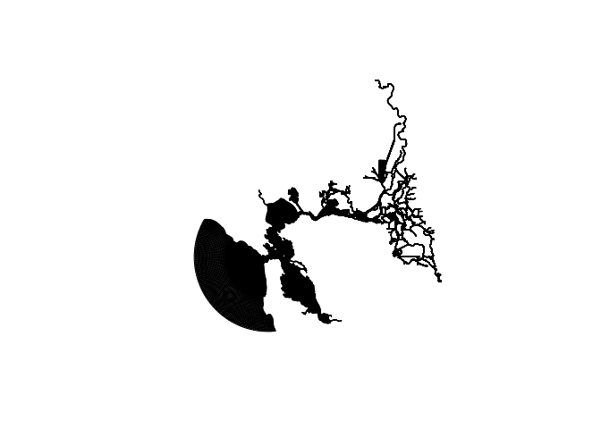

`{rcppsimdgeojson}`
================

  - [Installation](#installation)
  - [Conformance](#conformance)
  - [Benchmarking](#benchmarking)
      - [`<sfc>`](#sfc)
          - [Big File](#big-file)
          - [Tiny Files](#tiny-files)
          - [Tiny Strings](#tiny-strings)

<!-- README.Rmd generates README.md. -->

<!-- badges: start -->

[](https://github.com/knapply/rcppsimdgeojson/commits/master)
[](https://www.tidyverse.org/lifecycle/#experimental)
[](https://github.com/knapply/rcppsimdgeojson/actions?workflow=R-CMD-check)
[](https://codecov.io/gh/knapply/rcppsimdgeojson?branch=master)
[](https://www.gnu.org/licenses/gpl-3.0)
[](https://www.r-project.org/)
[](https://en.cppreference.com/w/cpp/17)
[](https://gcc.gnu.org/)
[](https://clang.llvm.org/)
[](https://cran.r-project.org/bin/windows/Rtools/)

<!-- badges: end -->

***WIP: This is still not useful…***

## Installation

``` r
if (!requireNamespace("remotes", quietly = TRUE)) install.packages("remotes")
remotes::install_github("knapply/rcppsimdgeojson")
```

``` r
geojson_files <- list.files(system.file("geojsonexamples", package = "rcppsimdgeojson"),
                            recursive = TRUE, pattern = "\\.geojson$", full.names = TRUE)
geojson_files <- geojson_files[!grepl("largeMixedTest", geojson_files, fixed = TRUE)]

names(geojson_files) <- basename(geojson_files)
```

## Conformance

``` r
identical_w_sf <- vapply(
  geojson_files, function(.file) {
  identical(rcppsimdgeojson:::.fload_sfc(.file), sf::read_sf(.file)$geometry)
  }, 
  logical(1L)
)

stopifnot(all(identical_w_sf))
as.matrix(identical_w_sf)
```

    #>                            [,1]
    #> featureCollection.geojson  TRUE
    #> holeyMultiPolygon.geojson  TRUE
    #> holeyPolygon.geojson       TRUE
    #> lineString.geojson         TRUE
    #> multiLineString.geojson    TRUE
    #> multiPoint.geojson         TRUE
    #> multiPolygon.geojson       TRUE
    #> point.geojson              TRUE
    #> polygon.geojson            TRUE
    #> GeometryCollection.geojson TRUE

``` r
big_geojson <- path.expand("~/Downloads/bay_delta_89b.geojson")

test <- rcppsimdgeojson:::.fload_sfc(big_geojson)
target <- sf::read_sf(big_geojson)$geometry
stopifnot(identical(test, target))

test
```

    #> Geometry set for 258032 features 
    #> geometry type:  MULTIPOLYGON
    #> dimension:      XY
    #> bbox:           xmin: -123.0052 ymin: 37.40251 xmax: -121.2558 ymax: 38.80345
    #> CRS:            4326
    #> First 5 geometries:

    #> MULTIPOLYGON (((-121.7215 38.80249, -121.7211 3...

    #> MULTIPOLYGON (((-121.7215 38.80257, -121.7211 3...

    #> MULTIPOLYGON (((-121.7215 38.80234, -121.7211 3...

    #> MULTIPOLYGON (((-121.7211 38.80249, -121.7207 3...

    #> MULTIPOLYGON (((-121.7211 38.80255, -121.7207 3...

``` r
plot(test)
```



## Benchmarking

### `<sfc>`

#### Big File

``` r
sprintf("%f MB", file.size(big_geojson) * 1e-6)
```

    #> [1] "103.882182 MB"

``` r
microbenchmark::microbenchmark(
  rcppsimdgeojson = rcppsimdgeojson:::.fload_sfc(big_geojson),
  geojsonsf = geojsonsf:::rcpp_read_sfc_file(big_geojson, mode = "rb",
                                             flatten_geometries = FALSE)
  ,
  times = 5
)
```

    #> Unit: milliseconds
    #>             expr       min        lq      mean    median        uq      max neval
    #>  rcppsimdgeojson  458.4896  464.2956  479.5942  464.8024  469.1582  541.225     5
    #>        geojsonsf 1145.4133 1164.2619 1185.0983 1165.9389 1219.1738 1230.704     5

#### Tiny Files

``` r
lapply(geojson_files, function(.file) {
  microbenchmark::microbenchmark(
    rcppsimdgeojson = rcppsimdgeojson:::.fload_sfc(.file),
    geojsonsf = geojsonsf:::rcpp_read_sfc_file(.file, mode = "rb",
                                               flatten_geometries = FALSE),
    unit = "relative"
  )
})
```

    #> $featureCollection.geojson
    #> Unit: relative
    #>             expr     min       lq     mean   median       uq      max neval
    #>  rcppsimdgeojson 1.00000 1.000000 1.000000 1.000000 1.000000 1.000000   100
    #>        geojsonsf 1.59358 1.553137 1.483777 1.457768 1.438901 2.138453   100
    #> 
    #> $holeyMultiPolygon.geojson
    #> Unit: relative
    #>             expr      min       lq     mean   median       uq       max neval
    #>  rcppsimdgeojson 1.000000 1.000000 1.000000 1.000000 1.000000 1.0000000   100
    #>        geojsonsf 1.292459 1.295429 1.299119 1.282219 1.282355 0.6616705   100
    #> 
    #> $holeyPolygon.geojson
    #> Unit: relative
    #>             expr      min       lq     mean   median       uq      max neval
    #>  rcppsimdgeojson 1.000000 1.000000 1.000000 1.000000 1.000000 1.000000   100
    #>        geojsonsf 1.292864 1.273853 1.349574 1.248641 1.257642 3.256222   100
    #> 
    #> $lineString.geojson
    #> Unit: relative
    #>             expr      min     lq     mean   median       uq       max neval
    #>  rcppsimdgeojson 1.000000 1.0000 1.000000 1.000000 1.000000 1.0000000   100
    #>        geojsonsf 1.251347 1.2335 1.226619 1.194595 1.167392 0.7368932   100
    #> 
    #> $multiLineString.geojson
    #> Unit: relative
    #>             expr      min       lq     mean   median       uq       max neval
    #>  rcppsimdgeojson 1.000000 1.000000 1.000000 1.000000 1.000000 1.0000000   100
    #>        geojsonsf 1.211802 1.203885 1.121118 1.168382 1.163104 0.6513514   100
    #> 
    #> $multiPoint.geojson
    #> Unit: relative
    #>             expr      min       lq     mean   median       uq      max neval
    #>  rcppsimdgeojson 1.000000 1.000000 1.000000 1.000000 1.000000 1.000000   100
    #>        geojsonsf 1.247281 1.250225 1.316345 1.222623 1.225344 2.806003   100
    #> 
    #> $multiPolygon.geojson
    #> Unit: relative
    #>             expr      min       lq     mean   median       uq      max neval
    #>  rcppsimdgeojson 1.000000 1.000000 1.000000 1.000000 1.000000 1.000000   100
    #>        geojsonsf 1.260141 1.258378 1.250315 1.227532 1.221181 2.088158   100
    #> 
    #> $point.geojson
    #> Unit: relative
    #>             expr      min       lq     mean   median       uq       max neval
    #>  rcppsimdgeojson 1.000000 1.000000 1.000000 1.000000 1.000000 1.0000000   100
    #>        geojsonsf 1.241257 1.233953 1.133211 1.172206 1.171299 0.7181437   100
    #> 
    #> $polygon.geojson
    #> Unit: relative
    #>             expr      min       lq     mean   median     uq       max neval
    #>  rcppsimdgeojson 1.000000 1.000000 1.000000 1.000000 1.0000 1.0000000   100
    #>        geojsonsf 1.240968 1.219315 1.167883 1.191796 1.1861 0.6545352   100
    #> 
    #> $GeometryCollection.geojson
    #> Unit: relative
    #>             expr     min       lq     mean   median       uq       max neval
    #>  rcppsimdgeojson 1.00000 1.000000 1.000000 1.000000 1.000000 1.0000000   100
    #>        geojsonsf 1.27378 1.289673 1.227407 1.263225 1.237283 0.6319355   100

#### Tiny Strings

``` r
geojson_strings <- vapply(geojson_files, function(.file) {
  readChar(.file, nchars = file.size(.file))
}, character(1L))


lapply(geojson_strings, function(.geojson) {
  microbenchmark::microbenchmark(
    rcppsimdgeojson = rcppsimdgeojson:::.fparse_sfc(.geojson),
    geojsonsf = geojsonsf:::rcpp_geojson_to_sfc(.geojson, expand_geometries = FALSE),
    unit = "relative"
  )
})
```

    #> $featureCollection.geojson
    #> Unit: relative
    #>             expr      min       lq     mean   median       uq       max neval
    #>  rcppsimdgeojson 1.000000 1.000000 1.000000 1.000000 1.000000 1.0000000   100
    #>        geojsonsf 1.922794 1.890271 1.367283 1.764667 1.761595 0.2274259   100
    #> 
    #> $holeyMultiPolygon.geojson
    #> Unit: relative
    #>             expr      min       lq     mean  median       uq       max neval
    #>  rcppsimdgeojson 1.000000 1.000000 1.000000 1.00000 1.000000 1.0000000   100
    #>        geojsonsf 1.431874 1.425607 1.368339 1.36051 1.343569 0.8370553   100
    #> 
    #> $holeyPolygon.geojson
    #> Unit: relative
    #>             expr      min       lq     mean   median       uq      max neval
    #>  rcppsimdgeojson 1.000000 1.000000 1.000000 1.000000 1.000000 1.000000   100
    #>        geojsonsf 1.436754 1.415151 1.436572 1.366696 1.367016 3.177738   100
    #> 
    #> $lineString.geojson
    #> Unit: relative
    #>             expr      min       lq     mean   median       uq       max neval
    #>  rcppsimdgeojson 1.000000 1.000000 1.000000 1.000000 1.000000 1.0000000   100
    #>        geojsonsf 1.297673 1.303339 1.340713 1.265382 1.257138 0.8820682   100
    #> 
    #> $multiLineString.geojson
    #> Unit: relative
    #>             expr      min       lq     mean   median       uq       max neval
    #>  rcppsimdgeojson 1.000000 1.000000 1.000000 1.000000 1.000000 1.0000000   100
    #>        geojsonsf 1.291054 1.295179 1.209248 1.274731 1.260475 0.4860164   100
    #> 
    #> $multiPoint.geojson
    #> Unit: relative
    #>             expr      min       lq     mean   median       uq       max neval
    #>  rcppsimdgeojson 1.000000 1.000000 1.000000 1.000000 1.000000 1.0000000   100
    #>        geojsonsf 1.350612 1.338359 1.193097 1.299008 1.253145 0.4532888   100
    #> 
    #> $multiPolygon.geojson
    #> Unit: relative
    #>             expr      min       lq     mean   median       uq      max neval
    #>  rcppsimdgeojson 1.000000 1.000000 1.000000 1.000000 1.000000 1.000000   100
    #>        geojsonsf 1.364633 1.329359 1.349523 1.325072 1.297662 1.540248   100
    #> 
    #> $point.geojson
    #> Unit: relative
    #>             expr      min       lq     mean   median       uq      max neval
    #>  rcppsimdgeojson 1.000000 1.000000 1.000000 1.000000 1.000000 1.000000   100
    #>        geojsonsf 1.300487 1.288886 1.405661 1.264872 1.254386 3.905227   100
    #> 
    #> $polygon.geojson
    #> Unit: relative
    #>             expr      min       lq     mean   median       uq      max neval
    #>  rcppsimdgeojson 1.000000 1.000000 1.000000 1.000000 1.000000 1.000000   100
    #>        geojsonsf 1.372396 1.366601 1.255945 1.297399 1.268917 1.410997   100
    #> 
    #> $GeometryCollection.geojson
    #> Unit: relative
    #>             expr     min       lq     mean   median       uq    max neval
    #>  rcppsimdgeojson 1.00000 1.000000 1.000000 1.000000 1.000000 1.0000   100
    #>        geojsonsf 1.39279 1.373306 1.307281 1.298342 1.274739 1.3844   100
